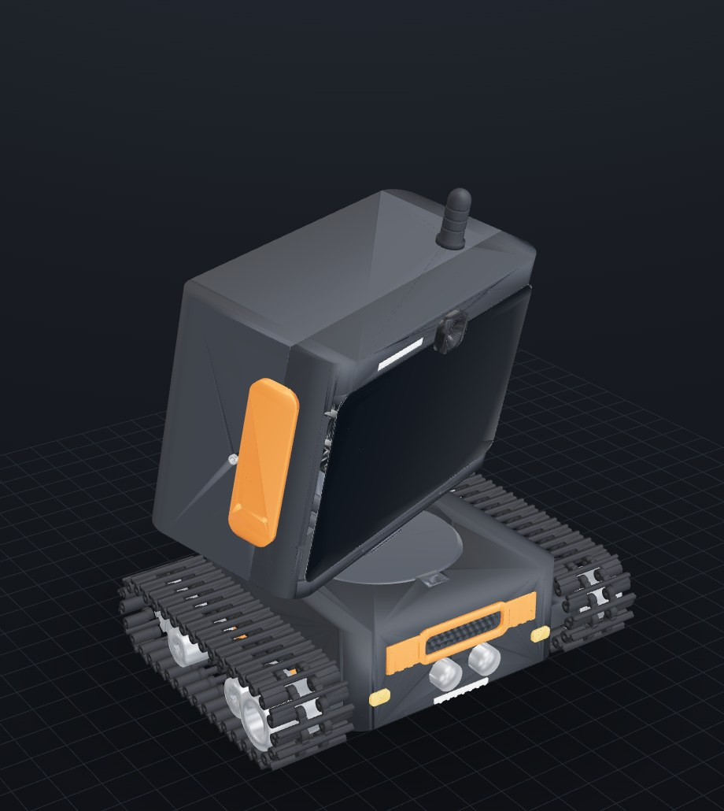
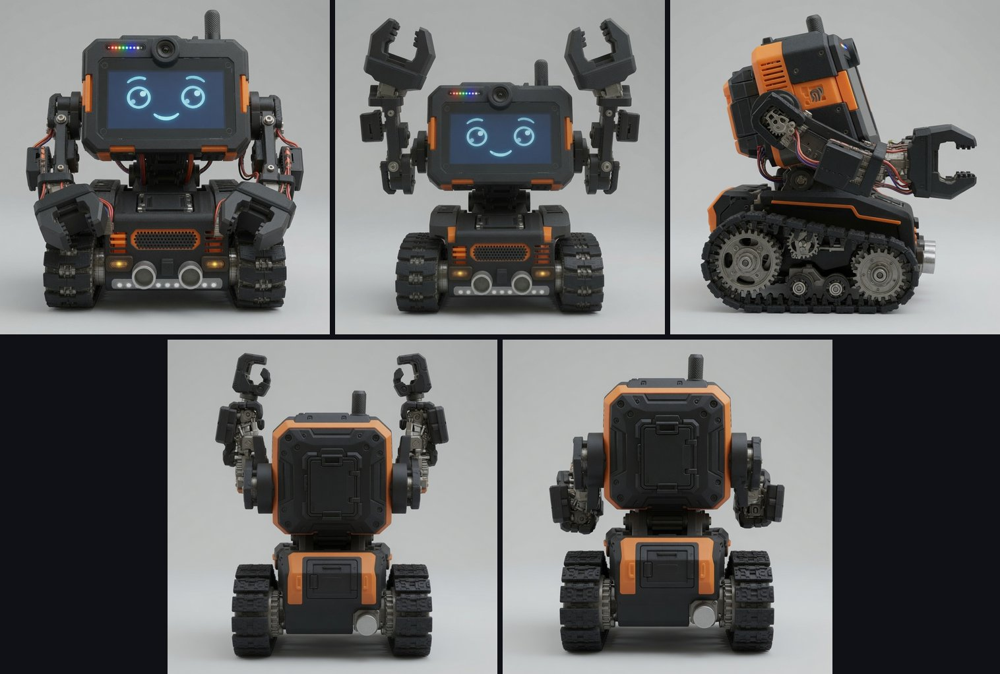
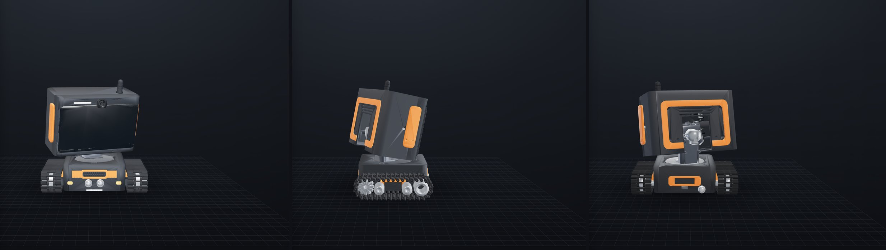
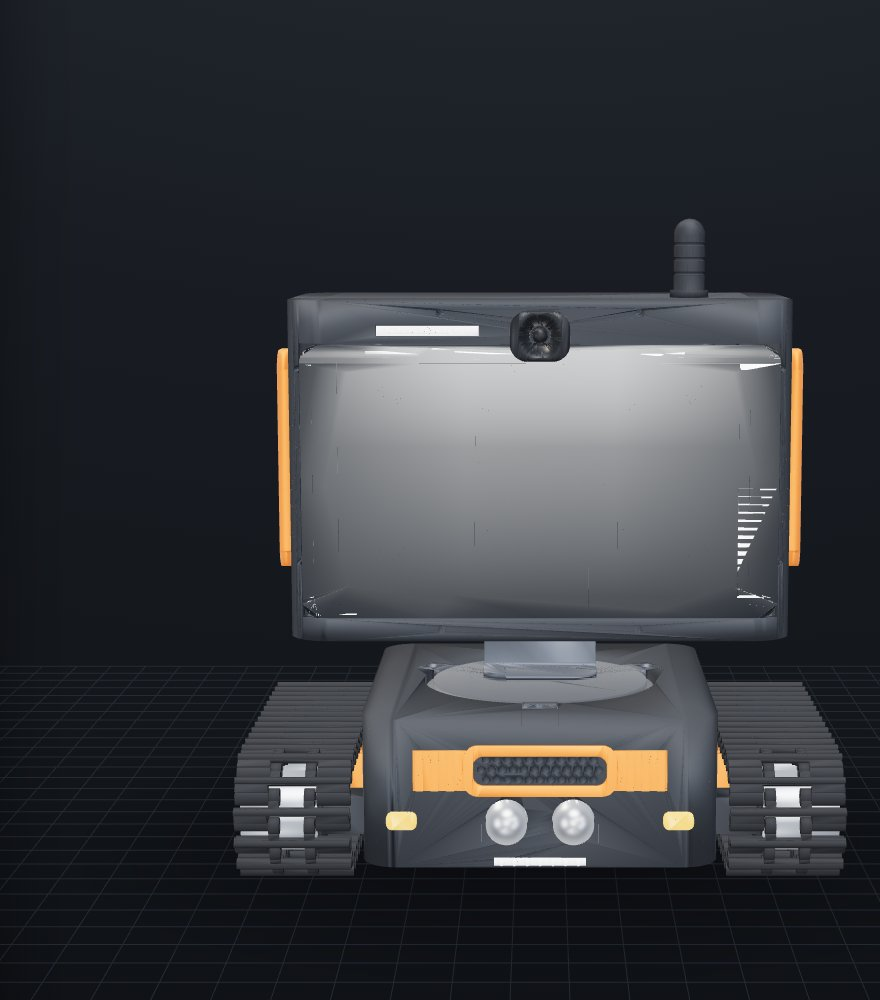
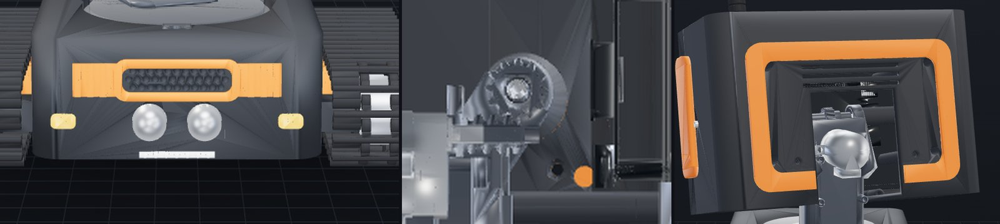
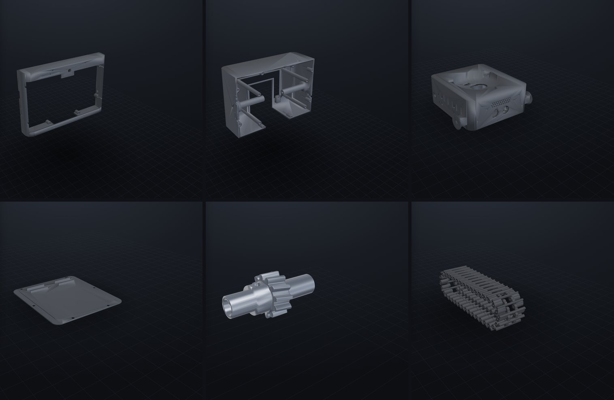
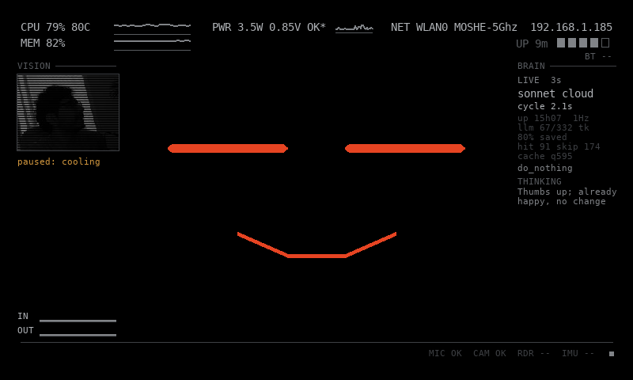

<p align="center">
  
</p>

<h1 align="center">Parviz</h1>

<p align="center"><b>Your desk AI.</b> A 3D-printed tank-tracked robot with a real face.</p>

<p align="center">
  <a href="https://m-esm.github.io/Parviz/viewer_glb.html"><b>&#9654; Spin the full assembly in your browser</b></a>
  &mdash; live 3D viewer with pan/tilt pose sliders, per-part toggles and the fit map
</p>

Parviz is a small tank-tracked robot that lives on a desk. A Raspberry Pi 5 drives
the official 7" touchscreen as an animated face, a Camera Module 3 sits behind the
forehead as an eye, and a pan/tilt neck lets the head look around. Two motor-driven
tank tracks let it drive. The whole thing is designed to print on a hobby FDM machine
(Bambu A1 class) and assemble with M2/M3 hardware plus a handful of bought bearings.

The mechanical design is parametric Python (`trimesh` + `manifold3d` + `shapely`), built
into a single `web/assembly.glb` you can spin in a browser. Every geometry change goes
through a headless render-and-inspect loop and a pairwise + pose-grid interference gate
before it counts as done. 39 parts, of which 10 are watertight printed structural parts;
the rest are cosmetics, bought hardware, and mechanism placeholders.

**Status:** design-complete and interference-gated in CAD, not yet printed or assembled.

## Designed to a concept, not vibes

<p align="center">
  
</p>

The look came first. Five concept renders (`reference/design/`) fixed the design language:
a black-and-orange tracked body, a clean rounded tablet head with a cyan-eyed face, corner
lamps, a stubby antenna. The CAD was then built to match that silhouette around the real
hardware, not the other way round. The head is a rounded box (it started as an Echo-Show
wedge, since simplified) sized 205 mm wide to wrap the actual 192.96 mm touchscreen+Pi
module with room for the bezel.

## How it's engineered

**Tilt = self-locking worm drive.** The head pitches on a single-start involute worm meshing
a 12-tooth helical wheel, module 1.25, center distance 11.9 mm, lead angle ~8.1°. Single-start
plus printed-PLA friction (µ ≈ 0.3 vs the 0.129 self-lock threshold) means the head holds any
tilt angle with the motor de-energized: no idle current, no heat. The worm rides a 28BYJ-48
stepper (shaft +Y, right-angle to the axle); the wheel keys to a Ø5 hollow axle turning in two
695-2RS bearings pressed into the neck cheeks. Real tooth geometry is generated from first
principles (numpy involute → manifold twisted extrude) and verified to mesh cleanly (zero boolean interference)
at nominal center distance. See [docs/WORM.md](docs/WORM.md).

**Pan = direct D-hub on a captured-ball race.** A second 28BYJ-48 sits offset in the base so its
double-D shaft lands exactly on the pan axis and keys straight into a D-bore hub under the
platform: no reduction, no coupler fighting the offset. The top-heavy head rides a lazy-Susan
race of 18 loose 6 mm airsoft BBs on an Ø80 circle, captured between the platform's grooved
underside and the `pan_race` ring. A balanced vertical axis has no gravity torque to hold, so no
worm needed here. Software clamps pan to ±88° so the Pi power service loop never over-winds.

**Tracks = positive-drive tank pods.** Each side runs 36 printed link pads on Ø1.75 filament-rod
hinge pins (72 pins, ~3.4 m of filament) around a stadium loop, driven by a 12-tooth sprocket at
the rear and tensioned by an F688ZZ idler at the front. Positive tooth engagement beats a friction
belt that would slip when the head pans hard. One TT gearmotor per pod, skid/differential steer off
a single MX1588 H-bridge. Track geometry is adapted from the Thingiverse tank-track reference.

**Verification gates.** Nothing ships on a "looks right" render. `make check` runs pairwise
boolean interference across all parts (whitelist-aware for intended contacts); `make check-sweep`
re-runs it across the full pan × tilt pose grid so a joint that only clashes at −30° tilt gets
caught. An 18-step insertion/torque-path audit confirmed a complete assembly order exists with every
screw reachable at some point in the sequence (see below). Cable routing was re-verified segment by
segment with swept-conduit clearance probes after the head geometry moved.

## Gallery

<p align="center">
  
</p>

<p align="center">
  
</p>

<p align="center">
  
</p>

<p align="center">
  
</p>

## Build it

The loop, on every geometry change:

```bash
make install     # trimesh toolchain + headless Chromium (first time only)
make build       # python3 src/build.py -> web/assembly.glb
make viewer      # http://localhost:8770/viewer_glb.html (live-reloads on rebuild)
make shot        # headless renders -> .claude/renders/ (viewer must be running)
make check       # pairwise interference gate on the current assembly
make check-sweep # interference gate across the pan x tilt pose grid
```

`EXPORT=1 python3 src/build.py` writes the per-part STLs under `stl/{base,neck,head}/`.

**Assembly** is a verified 18-step order, from an insertion-path and torque-path audit, in
[docs/ASSEMBLY.md](docs/ASSEMBLY.md), including the full BOM cross-checked against on-hand
inventory. A few joints are reachable at exactly one point in the sequence (the worm-wheel grub
is bench-only; the screen standoffs must go in before the rear trim), so read the order
constraints before you start.

**Order now** (the long-lead / not-in-a-typical-bin parts):

- 2× F688ZZ flanged bearings (8×16×5): the track idler seats are modeled around them
- 1× TT gearmotor 1:120 to match the owned one (or commit to 2× N20 for a lower CoM)
- Official Raspberry Pi 27W USB-C PD supply (5.1V/5A): a 3A brick browns out under screen + camera + steppers
- Ø5 rod (~100 mm) for the tilt axle; a bag of 6 mm airsoft BBs (need 18) for the pan race
- 1 m narrow addressable LED strip (SK6805-2427 / WS2812-2020) for the forehead + front dots

**The one special tool:** a slim M3 driver with ~95 mm reach. The four screen-module standoff
screws drive down blind Ø7 channels ~88.5 mm long with ~0.75 mm around an M3 pan head. Pan/cheese
head only, a countersunk M3 (Ø6.0) will not enter the channel.

## Software

<p align="center">
  
</p>

A live frame from the running robot (dumped over SSH with `kill -USR1`): the orange
face mid-conversation, CPU/power/net HUD, the camera vision panel, and the brain
column showing the cloud LLM tier ticking.

A working spike lives in `software/` (deployed to the Pi over rsync, key auth):

- **`face/`**: fullscreen 800×480 face renderer (pygame): navy background, cyan outlined eyes with
  offset pupils, arc brows, smile, idle blink. `set_expression()` API with neutral / happy / sad /
  surprised / sleepy / look_* states.
- **`motion/`**: 28BYJ-48 half-step driver (lgpio) with `PanStepper` (±88° hard clamp) and
  `TiltStepper` (±30°, 12:1 gear ratio, coils release after each move since the worm self-locks).
  Dry-run mode records coil writes without touching GPIO; 19/19 unit tests pass on any machine.
- **`camera/`**: one-frame capture check, Picamera2 with an `rpicam-still` fallback.

Runs on Raspberry Pi 5 (2GB), Raspberry Pi OS trixie, Camera Module 3 (imx708). See
[software/README.md](software/README.md) for deploy and smoke-test commands.

## Repo map

| Path | What |
|---|---|
| `src/build.py` | Source of truth. `PARAMS` block up top; builds chassis / tracks / pan / neck / head into the GLB |
| `src/serve.py` / `src/shoot.py` | Live viewer server / headless multi-angle renderer |
| `stl/{base,neck,head}/` | Per-part STLs written by `EXPORT=1` |
| `web/` | `viewer_glb.html` + committed `assembly.glb` (a fresh clone shows the robot) |
| `tools/gears/` | Worm/wheel tooth generator + mesh verifier (runs in a py3.10 venv) |
| `software/` | Face, stepper, and camera code for the Pi |
| `docs/` | [ASSEMBLY](docs/ASSEMBLY.md) (BOM + order), [WORM](docs/WORM.md), [ARM-MECH](docs/ARM-MECH.md), [PRINTABILITY](docs/PRINTABILITY.md), [CABLE-CHECK](docs/CABLE-CHECK.md), [FIXES](docs/FIXES.md) |
| `reference/` | Bought/borrowed CAD: touchscreen, camera, tank track, TT motor, display style |

## Design references & credits

Parviz stands on other people's models. All Thingiverse references are Creative Commons; keep the
attribution if you reuse them.

- **Tank track**: thing:3062624 by **advancedvb**, CC BY. Link pads, sprocket, and idler geometry.
- **Yellow TT motor**: thing:1079893 by **CCFIVE**, CC BY. Drive-motor placeholder.
- **Official 7" touchscreen reference model**: thing:1646255 by **clough42**, CC BY-SA. The
  combined screen+Pi (pins-out) mesh the whole robot is built around.
- **7" touchscreen case**: thing:1585924 by **luc_e**, CC BY-NC. Style/fit reference.
- **RPi Camera v2.1 model**: thing:1564160 by **jbeale**, CC BY. Camera placeholder (CM3 dims from
  the official Raspberry Pi mechanical drawing in `reference/rpi-camera-module-3/`).
- **Alexa-style smart display**: the wedge that inspired the original head shape
  (`reference/alexa-style-smart-display/`).
- **Concept renders**: the five AI-generated concept images in `reference/design/` that set the
  black-and-orange design language.
- Official Raspberry Pi CAD (touchscreen + Camera Module 3) from Raspberry Pi Ltd.

## License

The original work here (`src/`, `software/`, `docs/`, `tools/`, `web/`, `stl/`, CAD) is licensed
under **Apache-2.0** (see [LICENSE](LICENSE) and [NOTICE](NOTICE)).

The bundled `reference/` meshes are third-party and keep their own Creative Commons terms, listed
in [THIRD-PARTY-NOTICES.md](THIRD-PARTY-NOTICES.md). Two are restrictive: the touchscreen model is
**CC BY-SA** and the touchscreen case is **CC BY-NC**, so redistributing the repo as a whole is
non-commercial while those files are present. Remove them (and fetch at build time) if you need a
fully permissive tree.
